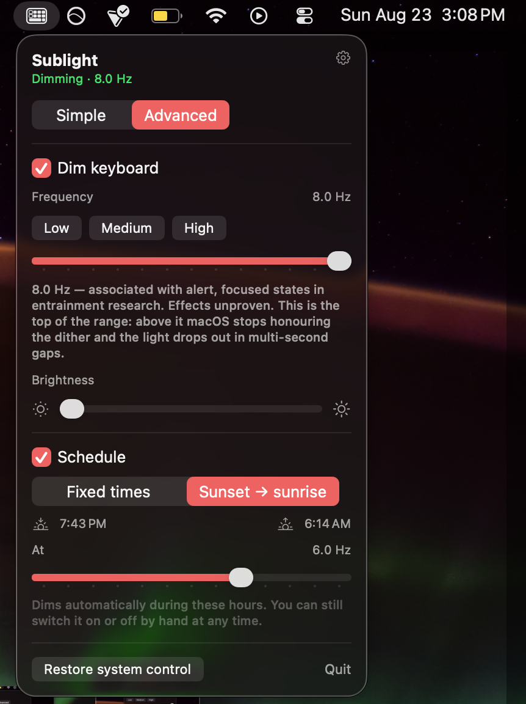
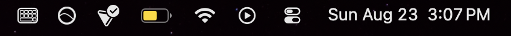
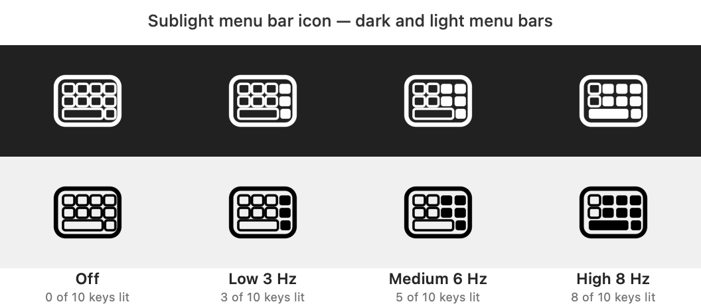
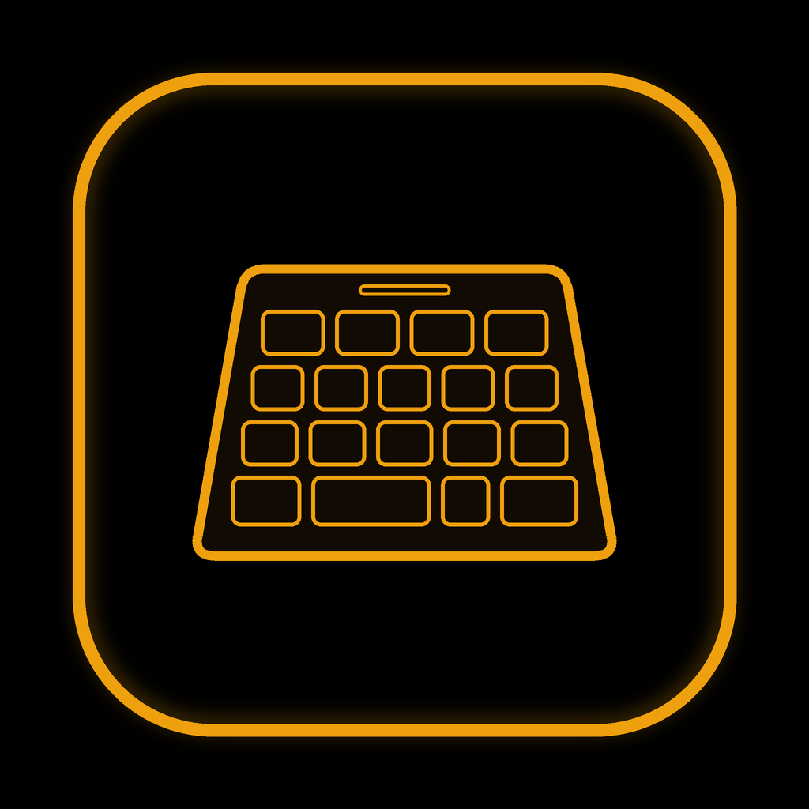
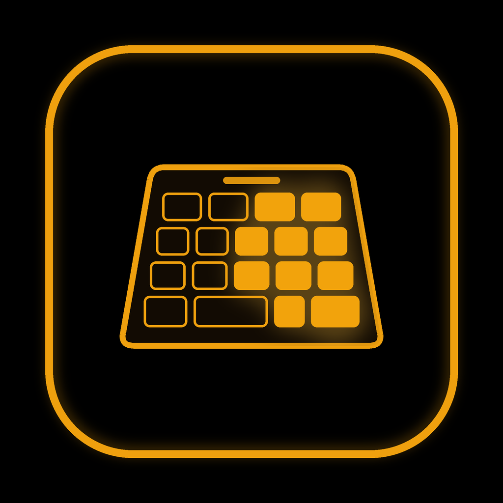

<p align="center">
  
</p>

<div align="center">

# Sublight

**Dim your MacBook's keyboard backlight below the macOS minimum.**

Free and open source · Apache 2.0 · zero dependencies · zero network calls

</div>

---

**Sublight** dims your MacBook's keyboard backlight below the minimum macOS
allows.

It works by pulsing: the backlight switches fully on and off a few times per
second (presets at 3, 6, and 8 Hz), so the keys spend most of each cycle dark
and the average glow drops beneath the system floor. The pulse is visible in
every mode — a slow blink at 3 Hz, a fast flicker at 8. That flicker is not a
defect: it is the mechanism, and the measured price of sub-floor dimming. The
backlight daemon will not sustain a cycle above 8 Hz (measured, enforced as a
hard ceiling), and flicker fusion needs more than that — so Sublight tells you
the truth instead of promising a steady glow it cannot produce.

**Before you enable it:** flashing light in the 3–30 Hz range can trigger
seizures in people with photosensitive epilepsy. Read [SAFETY.md](SAFETY.md)
first, and do not use Sublight if you — or anyone who can see your keyboard — is
sensitive to flicker. The app asks for explicit consent the first time you
enable dimming.

Every claim above is a measurement, not an assumption — the boundary tables, the
daemon's cycle-period limit, and the read-back APIs that lie are documented in
[docs/COREBRIGHTNESS.md](docs/COREBRIGHTNESS.md).

| Simple — one switch and a brightness slider | Advanced — presets, custom frequency, schedule |
|---|---|
|  |  |

**Asked once, before the backlight is ever touched.** Declining records nothing
and changes nothing:


**In the menu bar**, the glyph sits among your other status items — hollow here,
because dimming is off:



## ⚠️ Read this first

- **Photosensitivity — [read `SAFETY.md`](SAFETY.md) before installing.**
  Sublight dims by flickering the backlight between 3 and 8 Hz, inside the
  3–30 Hz photosensitive band, which can trigger seizures in people with
  photosensitive epilepsy. **No mode is flicker-free** — that is measured, not
  estimated: fusing the flicker would need a faster cycle than the macOS
  backlight daemon will accept. **If you or anyone who can see your keyboard
  has any history of photosensitivity or epilepsy, do not use this app.** See
  also [`DISCLAIMER`](DISCLAIMER).
- **Effects are unproven.** Flickering light produces a measurable response in
  the visual cortex, but there is no reliable evidence it improves mood, focus,
  or sleep, and Sublight claims none. It is not a medical device.
- **Private API.** Sublight drives the backlight through Apple's private
  `CoreBrightness` framework. Apple can change or remove it in any update. Calls
  are guarded and fail gracefully, but expect to re-verify after macOS updates.
- **No warranty** (Apache 2.0, see [`LICENSE`](LICENSE)). This cannot ship on the
  Mac App Store — private API plus the required sandbox — see
  [`docs/APPSTORE_AND_HEALTH.md`](docs/APPSTORE_AND_HEALTH.md).

## Requirements

- **Apple Silicon MacBook with a backlit keyboard.** Intel Macs and external
  keyboards are not supported and never will be.
- **macOS 14 or later.** Honest caveat: development and testing have happened
  **only on macOS 26** on a MacBook Air (M4). Earlier versions should work — the
  APIs used are available — but are untested. Reports welcome.
- Xcode Command Line Tools (`xcode-select --install`)

## Install

> **Before you install: [read `SAFETY.md`](SAFETY.md).** Sublight's only
> mechanism is flicker in the 3–8 Hz range, no mode is flicker-free, and that
> matters for anyone who can see your keyboard — not only for you. The app asks
> you to confirm you have read it the first time you enable dimming.

No signed release yet, so build from source:

```bash
git clone https://github.com/<you>/sublight.git && cd sublight
swift build -c release --product SublightApp
./scripts/make_app.sh
open build/Sublight.app
```

To keep it, drag `build/Sublight.app` to `/Applications` — the login item only
persists from a stable location.

The CLI (also the reverse-engineering and validation harness) builds separately:

```bash
swift build -c release --product sublight-cli
.build/release/sublight-cli help
```

## Using it

Sublight lives in the menu bar — no Dock icon, no window.

### The menu bar icon



Hollow keys mean Sublight is not dimming — either you have it off, or the system
has suspended it (sleep, screens off, a fast user switch). The keys then fill
from the right as the active preset rises: 3 of 10 at Low, 5 at Medium, 8 at
High. The icon is a template image, so macOS tints it to match the menu bar's
light or dark appearance and reduced-transparency modes; the two rows above show
the same four states as macOS would draw them.

*(The icon is drawn in code at runtime — no PNG is bundled. The legend above is
regenerated from that same drawing with `sublight-cli glyph render`, so it
cannot drift from the geometry.)*

**First launch** walks through a short onboarding: what the app does, the safety
warning (with an acknowledgment you have to tick), and an offer to calibrate.

**Simple mode** is one switch and a brightness slider. It runs at the steadiest
frequency for you — the one calibration measured, or 8 Hz until you calibrate —
and never mentions Hz. This is the right mode if you just want dim keys.

**Advanced mode** exposes the second axis: preset frequencies at **3 / 6 / 8 Hz**,
a **2–8 Hz** custom slider, and a separate brightness slider. Frequency and
brightness are inversely coupled on this hardware — higher frequencies are
dimmer *and* steadier — so they're presented as two independent knobs.

| Off — system control | On — Sublight active |
|---|---|
|  |  |

**Schedule** dims automatically, either between two fixed times or from
**sunset to sunrise**. It acts on transitions, so you can still override it by
hand in between. In Advanced mode the schedule can run at its own frequency.

Solar scheduling needs to know roughly where you are. Pick your city from the
list in Settings — it's usually already selected, because Sublight matches your
Mac's time zone on first run — or enter coordinates by hand.
Sublight deliberately does *not* use CoreLocation: that would spend a permission
prompt, and macOS location services commonly resolve position over the network —
which would quietly break this app's no-network promise. The sunrise/sunset maths
runs locally, and your coordinates never leave the machine.

**Global shortcut** (Settings → General) toggles dimming from anywhere. Four
presets; no Accessibility permission needed.

**Settings** (⌘, or the gear) holds launch-at-login, the shortcut, calibration,
reset, the full safety text, and version info.

### If the backlight gets stuck

Press the keyboard brightness keys — the system takes control back immediately.
Relaunching Sublight (or running `sublight-cli restore`) also auto-restores: a
crash leaves a flag that the next launch heals before doing anything else.

## Calibrate — please actually do this

The shipped defaults were measured on **one** MacBook Air. Two numbers vary:
where *your* keyboard's backlight actually bottoms out, and how fast it has to
flicker before *you* stop seeing it. If dimming feels weak or absent on your
machine, this is almost certainly why.

**Settings → General → Calibrate**, in a dark room, about a minute. Three steps:
a brighter/same comparison to find the hardware floor, a steady/pulsing
comparison to find your personal flicker threshold, then a slider for your
preferred level. Results are stored per Mac model.

## Hardware compatibility

Behaviour varies by machine. If you run Sublight, please add a row — calibrate, then file a
**Hardware report** issue (there's a template) or open a PR.

| Model identifier | Mac | macOS | Measured floor | Stability ceiling | Works |
|---|---|---|---|---|---|
| `Mac16,12` | MacBook Air 13" (M4) | 26 | ~0.0625 | 8 Hz (8.5 Hz fails) | ✅ |

**Stability ceiling** is the highest frequency the backlight daemon will actually
hold. It is a hardware/OS limit, not a claim about your eyes: above it the keys
fall dark for seconds at a time no matter how perfectly the commands are sent.
Flicker *fusion* is a separate, personal thing, and on the reference machine the
dither is still visible as flicker at the ceiling.

## Known limitations

- **Control Center's keyboard slider jitters** while Sublight is active *and*
  Control Center is open. Sublight writes the backlight value many times a
  second; Control Center polls it and redraws. Cosmetic, only visible when
  you're looking at it, and inherent to dithering.
- **There is a hard stability ceiling at 8 Hz on the reference machine.** Above
  it — measured, 8.5 Hz fails within 30 seconds — the backlight daemon stops
  honouring the dither and the keys fall completely dark for a second or more,
  repeating every one to three seconds. It is a limit on how short a dither
  *cycle* the daemon will act on (117.6 ms fails, 125.0 ms holds), not command
  coalescing and not your eye fusing the flicker; duty makes no difference and
  neither read-back API can see it happen. Sublight refuses to run above the
  ceiling and logs any request it clamps, so you cannot land there by accident.

  The ceiling is a property of the daemon, so a macOS update can move it —
  see [Re-qualifying after a macOS update](#re-qualifying-after-a-macos-update).

- **The dither is still visible as flicker at the ceiling** on the reference
  machine. Fusing it into a steady glow would need a frequency the daemon will
  not hold, so Sublight ships the honest version rather than one that looks
  smooth because it has stopped dimming.
- **Yield-to-manual-control is parked**: the reference machine has no
  keyboard-brightness keys, so there is nothing to yield to. See SPEC §11.

## How it works — and what could break

The private API cannot set a static level below the floor — it accepts the value,
reports success, and the driver clamps the actual light. The only way under is to
alternate between the floor and off; the LED's physical response and your eye's
partial fusion average that into a sub-floor brightness. The daemon refuses to act
on cycles shorter than ~125 ms (so **8 Hz is a hard ceiling**), and below ~3 Hz the
pulsing is obtrusive, so the usable band is narrow.

### What could break

Sublight drives **private `CoreBrightness` interfaces**. They are undocumented,
unsupported, and Apple owes them no stability. Nothing here was read from
documentation — every signature, every clamp, and the 8 Hz ceiling itself was
**verified empirically on macOS 26.6.1 (build 25G76), Mac16,12 (MacBook Air M4),
on 2026-08-23**. Any macOS update can invalidate any of it.

Two independent things can break, and they break differently:

1. **The interface can change.** A renamed class, a removed selector, or an
   argument whose type changed. The last one is the dangerous case: on arm64,
   floats travel in different registers than integers, so a mistyped argument
   does not fail — it silently misaligns every argument after it. So Sublight
   runs a **capability probe at launch** that checks each selector it depends on
   against the exact Objective-C type encoding it was verified against. On any
   mismatch the app **disables itself and says why**, and the CLI exits 3
   without touching the backlight. It refuses to guess.
2. **The behaviour can change.** The daemon's cycle-period limit is a runtime
   property, not an ABI one, so the probe cannot see it move. If the ceiling
   drops, dimming at 8 Hz starts falling into multi-second dark envelopes. That
   one needs eyes — see the re-qualification ritual below.

### API compatibility

Where the private interface has actually been verified. This is a different
question from [Hardware compatibility](#hardware-compatibility) above, which
records whether dimming *works* on a given Mac.

| macOS build | Hardware | Verified | Status |
|---|---|---|---|
| 26.6.1 (25G76) | `Mac16,12` — MacBook Air 13" (M4) | 2026-08-23 | ✅ verified — all required selectors present with matching type encodings; 8 Hz ceiling confirmed by soak |

If you run Sublight on anything else, `sublight-cli sig` prints the true type
encodings on your machine and whether they match. Please add a row.

### Re-qualifying after a macOS update

The launch probe catches interface drift on its own. The **ceiling** it cannot
see, so check it by hand — your eyes are the only instrument that works. There
are two runs, and they look for different faults.

**1. The ceiling check — five minutes.**

```bash
sublight-cli hold --freq 8 --duty 0.15 --seconds 300
```

Watch the keys at roughly **0:30**, **2:30** and **4:30**. You are looking for a
*dark envelope*: the backlight dropping to complete darkness for a second or
more and then returning, repeating every one to three seconds. Steady flicker is
the expected, healthy result — the dither is supposed to be visible.

**Before either run: be the only engine.** Quit the menu-bar app and any other
`sublight-cli` process. Two engines commanding one daemon contend for every
edge, and the contention is invisible afterwards — each process's counters are
honest about its own edges and silent about the other's. `hold`, `pulse`,
`dither-test` and `pair-sweep` now refuse to start (exit 3) if another engine
holds the marker, and a running engine logs an error if one appears mid-run.
Three 25-minute soaks were spent before this was noticed.

**2. The idle check — twenty-five minutes, hands off.**

```bash
sublight-cli hold --freq 8 --duty 0.15 --seconds 1500
```

Start it and then **do not touch the trackpad, keyboard, or wake anything until
it finishes** — being idle is the condition under test, and one keypress resets
it. Glance at the keys at roughly **0:30**, **10:00**, **18:00**, **22:00** and
**25:00**; note each verdict on paper or a phone rather than typing it.

This run exists because of a defect found on 2026-08-26: dark envelopes at
*every* frequency, with an onset around twenty minutes of the machine being left
alone. Every soak in this project's history before that date was five minutes or
shorter, so a twenty-minute-onset fault was invisible to all prior measurement.
A clean five-minute run says nothing about this timescale.

When it exits, read the counters it prints — `skipMaxRunLength` should be 0 or 1,
and `longest gap between EXECUTED HIGH commands` should be about one period, not
seconds. If anything skipped, `sublight-cli status --json` carries a `lastSkip`
record with both edges' lateness, how far into the run it happened, and the
suppression flag states, which is what separates a timer fault from the daemon
taking the backlight back.

**Any dark envelope at any glance, in either run, means the ceiling no longer
holds.** Find the lowest frequency that still fails, subtract 0.5 Hz, and that is
the new value for `DitherEngine.maxStableFrequencyHz`. Please
[file an issue](https://github.com/HypnoxAI/sublight/issues) with your macOS
build, your Mac model, what you saw, and the counters from the run.

### Related projects

Other people have driven the same framework, for different ends:

- **[KBPulse](https://github.com/emorydunn/KBPulse)** — animates the keyboard
  backlight through `CoreBrightness` (pulses, patterns), operating in the normal
  brightness range.
- **[pirate/mac-keyboard-brightness](https://github.com/pirate/mac-keyboard-brightness)**
  — archived; reads and sets keyboard/display brightness on pre-2016 Macs
  through the older IOKit path.
- **[LightBoard](https://github.com/rcarmo/LightBoard)** — controls the
  backlight by simulating the hardware brightness keys through a virtual HID
  device.

None of them go **below the system floor**. That is the one thing Sublight does:
sub-floor output by duty-cycle dithering, held inside the cycle-period limit the
backlight daemon enforces.

### The full record

The complete reverse-engineering account — methodology, every finding with its
evidence, the dead ends, and why the read-back APIs turned out to be daemon
bookkeeping rather than LED truth — is in
[`docs/COREBRIGHTNESS.md`](docs/COREBRIGHTNESS.md). The design and its rationale
are in [`docs/SPEC.md`](docs/SPEC.md).

## CLI reference

| Command | Purpose |
|---|---|
| `status [--json]` / `ids` | keyboard ID, reported level, auto-brightness state |
| `version` | version and build number |
| `dump` / `sig` | private class's real selectors and their argument types |
| `get` / `set <0..1>` | read / write brightness (subject to the clamp) |
| `auto on\|off` | toggle keyboard auto-brightness |
| `probe [--fade\|--ramp]` | guided clamp, read-back and fade probes |
| `dither-test [--slow\|--fine]` | map the usable frequency band |
| `hold <0..1> [--period s]` | continuous dither at a level |
| `pulse <low\|medium\|high>` | continuous preset |
| `notify-probe` | change-notification spike |
| `restore [<0..1>]` | panic restore |

| `glyph render --out <dir>` | dev: redraw the menu bar legend from `StatusGlyph` |
| `social-preview --out <dir>` | dev: redraw the GitHub social card |

`hold` and `pulse` disable auto-brightness and restore it on Ctrl-C.
`--verbose` echoes the resolved configuration and the API probe to **stderr**,
so `status --json | jq` still works with it on.

### `status --json`

A versioned, stable schema — human status output may be reworded at any time,
this may not. Its key set is pinned by a test.

```
schemaVersion                       bump = a field removed or changed meaning
sublight   { version, build }
hardware   { model, chip, appleSilicon }
probe      { passed, macOSBuild, failures[] }     passed=false ⇒ nothing is driven
keyboard   { id, reportedLevel, autoBrightness, idleDimmed, assumedFloor }
engine     { mode, running, frequencyHz, duty, stabilityCeilingHz }
consent    { granted, recordedVersion, requiredVersion, pending }
suspended                           null from the CLI — see below
counters   { high{…}, low{…}, latency{…}, … }    scheduled/fired/executed/skipped
           { anchorResets, skipOnsetBuckets{…},   long-run diagnosis: when skips
             lastSkip{…} }                        started and which clock slipped
lastRecordedRun                     the last `hold --seconds` or `pair-sweep`, or null
```

Two things worth knowing before you parse it. **Unknown means `null`, never a
plausible default** — `suspended` is null from the CLI because a CLI process has
no sleep/wake observer and genuinely cannot answer; only the app can. And
`keyboard.reportedLevel` is what the *daemon* claims, which is not what the LED
is doing: see [finding 3](docs/COREBRIGHTNESS.md). Adding an optional field is
backwards compatible and will not bump `schemaVersion`; removing one will.

**If the backlight is ever left in a strange state** (e.g. after `kill -9`),
`sublight-cli restore` fixes it from any state. The app also self-heals on next
launch.

## Uninstall

```bash
rm -rf /Applications/Sublight.app
defaults delete com.hypnox.sublight 2>/dev/null || true
```

If you enabled launch-at-login, remove Sublight in
System Settings → General → Login Items.

## Contributing

Contributions welcome — see [`CONTRIBUTING.md`](CONTRIBUTING.md). The project
uses a **DCO**, not a CLA: sign off commits with `git commit -s`.

Bug reports about hardware behaviour are far more useful with diagnostics
attached: **Settings → Diagnostics → Copy** gets everything relevant in one
block (and deliberately excludes your coordinates). For anything involving the
private API, add `sublight-cli dump` and `sublight-cli sig` output too.

Deliberate non-goals: any network call, analytics or telemetry (which also rules
out an auto-updater), Intel support, per-key lighting, the Mac App Store, and any
health claim for the pulse feature.

## License

Apache License 2.0 — see [`LICENSE`](LICENSE) and [`NOTICE`](NOTICE).
Copyright 2026 Hypnox Technologies LLC.
